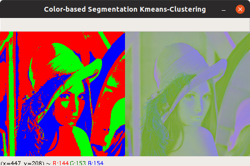

# K-Means Implementation for Image Color Quantization

## RGB Color Space, K=3

Total within cluster distance: 82483754.69

## LAB Color Space, K=3

Total within cluster distance: 30409606.07

## HSV Color Space, K=3

Total within cluster distance: 120510343.21

## RGB Color Space, K=6

Total within cluster distance: 33084652.27

## LAB Color Space, K=6

Total within cluster distance: 11775027.55

## HSV Color Space, K=6

Total within cluster distance: 37026829.32

## Interpretation of the Results

Applying K-means on an image for color quantization yields "similar" (in terms of chosen metric) pixels to be grouped into a pre-specified number of clusters (groups). Based on this cluster representation, the image can be represented by a reduced number of colors. Visual comparison to the original image can show which color parts of the image are "similar".

## K-Means Problems and Improvements

K-means algorithm finds a local rather than a global optimum, the results obtained will depend on the initial (random) cluster assignment. Therefore, the approximation found can be arbitrarily bad with respect to the objective function compared to the optimal clustering [source-1](https://en.wikipedia.org/wiki/K-means%2B%2B).

One solution to overcome this could be running the algorithm multiple times from different random initial configurations followed by chosing the best solution (smallest total within cluster distance) [source-2](https://www.academia.edu/36691506/An_Introduction_to_Statistical_Learning_Springer_Texts_in_Statistics_An_Introduction_to_Statistical_Learning). However, this could be a time consuming operation for a large data set.

There was proposed a k-means++ algorithm. It specifies a procedure to initialize the cluster centers before proceeding with the standard k-means optimization iterations. With the k-means++ initialization, the algorithm is guaranteed to find a solution that is O(log k) competitive to the optimal k-means solution [source-3](http://ilpubs.stanford.edu:8090/778/1/2006-13.pdf).

The k-means++ is implemented in the function `initialize_pp`.

## Appendix

Implemented k-means initializations:

* a random data point from the data set
* a random point from within the domain of the data set (can yield a devision by zero)
* k-means++
